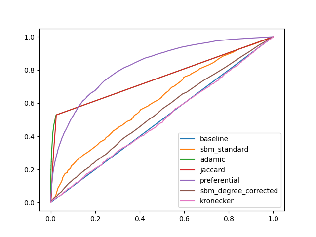
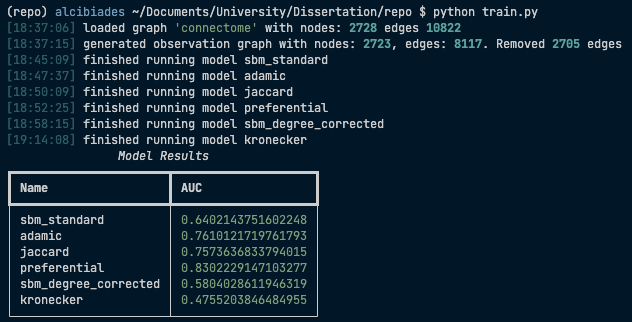

# Edge Regeneration in Neural Connectomes

## To Run

To run the program, run `python train.py` from the main directory. 
Currently, to modify what models are run change the array at line 134 of train.py.

The currently implemented models are as follows:

| Model                                     | Label              | Type      | Notes                 |
|-------------------------------------------|--------------------|-----------|-----------------------|
| Adamic Adar                               | `adamic`           | Classical |                       |
| Jaccard                                   | `jaccard`          | Classical |                       |
| Preferential Attachment                   | `preferential`     | Classical |                       |
| Stochastic Block Model - Standard         | `sbm_standard`     | SBM       |                       |
| Stochastic Block Model - Degree Corrected | `sbm_corrected`    | SBM       |                       |
| Stochastic Block Model - Hierarchical     | `sbm_hierarchical` | SBM       | Not fully implemented |
| Kronecker                                 | `kronecker`        |           |                       |

After training and running the models, train.py will then graph the Receiver Operating Characteristic (ROC) curve for all the models, and print out the Area Under Curve (AUC) scores for all models.

## TODO
- Research more datasets
- Start work on report
- Try and implement SEAL
- Try and optimise SBM
- See if Kronecker is salvageable